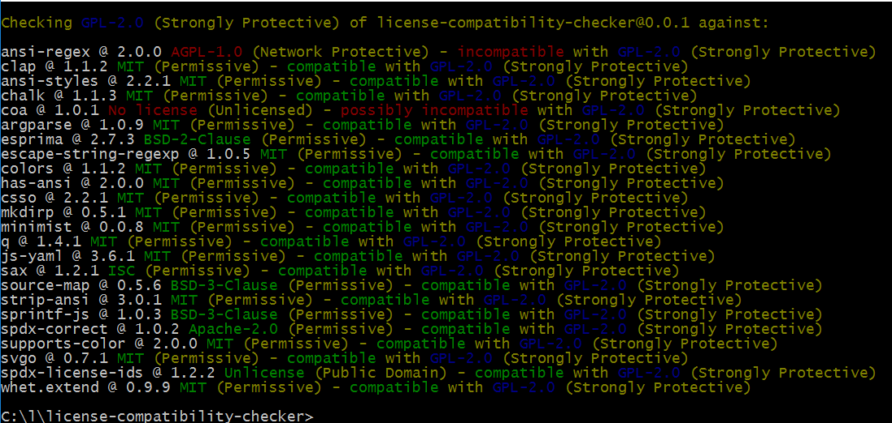
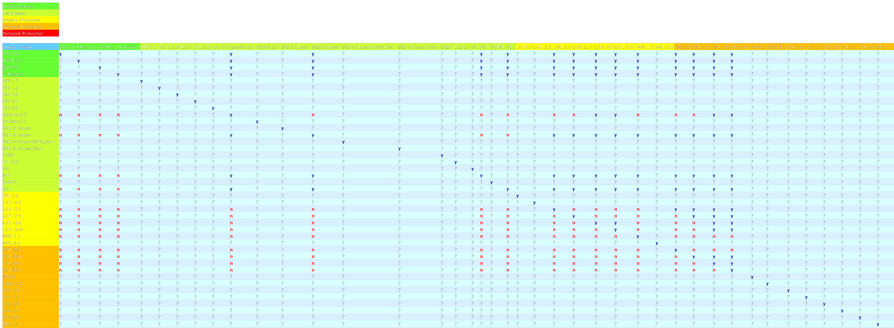

# license-compatibility-checker
Check npm dependencies' package.json for license compatibility (aka compliance check) with the current project based on spdx notation and naming conventions.

[](https://nodei.co/npm/license-compatibility-checker/) 
[](https://nodei.co/npm/license-compatibility-checker/)

[](https://www.npmjs.com/package/license-compatibility-checker)
[](https://www.npmjs.com/package/license-compatibility-checker)
[](https://www.npmjs.com/package/license-compatibility-checker)
[](https://www.npmjs.com/package/license-compatibility-checker)
[](http://packagequality.com/#?package=license-compatibility-checker)
[](http://inch-ci.org/github/HansHammel/license-compatibility-checker)
[](https://github.com/HansHammel/license-compatibility-checker)
[](https://github.com/HansHammel/license-compatibility-checker/fork)

[](https://david-dm.org/HansHammel/license-compatibility-checker)
[](https://david-dm.org/HansHammel/license-compatibility-checker)
[](https://david-dm.org/HansHammel/license-compatibility-checker)
[](https://david-dm.org/HansHammel/license-compatibility-checker)

## This is WIP and likely to change but already useable.
Does a simple comparison like Public Domain > Permissive > Weakly Protective > Strongly Protective > Network Protective of the primary dependencies in node_modules (no recursive search).
Checks for unlicensed or unknown licenses.

Screenshot with sample data (some licenses changed for demo)
[](screenshots/screen.png)

# Install

```sh
npm install license-compatibility-checker -g
```

or better

```sh
npm install license-compatibility-checker --save-dev
```

or

```sh
npm install https://github.com/HansHammel/license-compatibility-checker.git --save-dev
```

# Usage

## CLI

In your project folder run

```bash
license-compatibility-checker
```
	
or

```bash
lcc PATH_TO_PACKAGE_JSON
```
	
or (win)

```bash
.\node_modules\.bin\lcc ..\droppy\package.json c:/l/droppy/node_modules
```

or (*nix)

```bash
./node_modules/.bin/lcc PATH_TO_PACKAGE_JSON PATH_TO_MODULES
```

etc.

Supports to optional parameters: 
1. path to package json (defaults to ./package.json)
2. path to node_modules (defaults to ./node_modules)

Paths can be relative to the CWD and/or mixed Win/nix-style 

## As Module

### v0.2.x

```node
var lcc = require('license-compatibility-checker');
var path = require('path');
lcc.check(path.join(process.cwd(),'package.json'), path.join(process.cwd(),"node_modules"),function(/*error*/ err,/*boolean*/ passed,/*string*/ output){
  if (err) console.log(err);
  else if (passed)
  {
	//No license issues found
	console.log(output);
  } else
  { 
	//License issues found 
	console.log(output);
	//process.exit(1);
	//or
	//throw new Error('License issues found');
  }  
});
```

### v0.1.1

```node
var lcc = require('license-compatibility-checker');
var path=require('path');
lcc.check(path.join(process.cwd(),'package.json'), path.join(process.cwd(),"node_modules"));
```
 
 
### Honorable Mention
Based on license-compatibility ruby gem by Libraries.io


## A License Overview

[](licenses.svg)