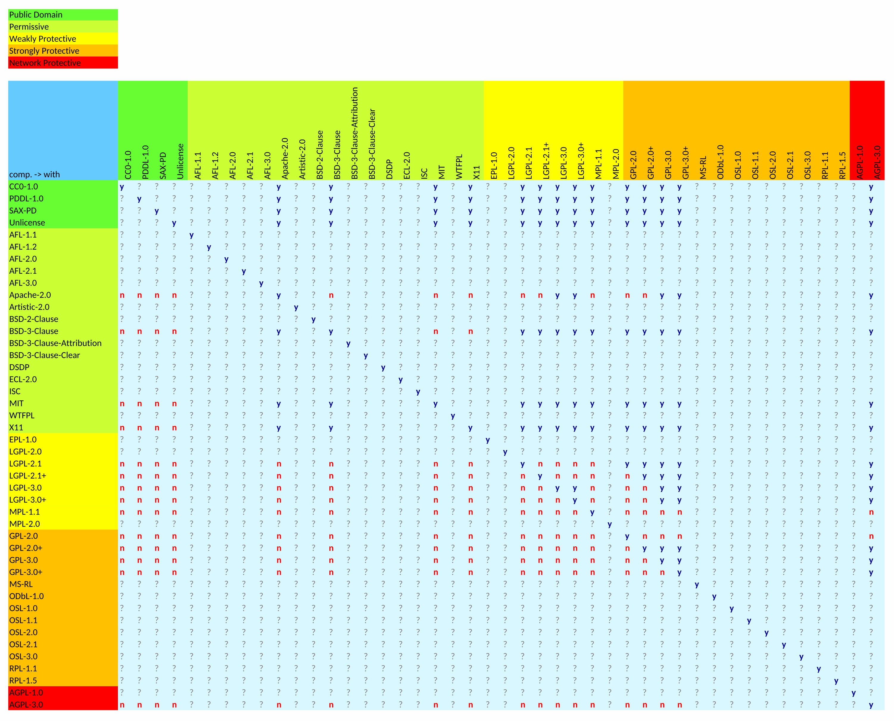

# license-compatibility-checker
Check npm dependencies' package.json for license compatibility (aka compliance check) with the current project based on spdx notation and naming conventions.

[](https://nodei.co/npm/license-compatibility-checker/) 
[](https://nodei.co/npm/license-compatibility-checker/)

[](https://www.npmjs.com/package/license-compatibility-checker)
[](https://www.npmjs.com/package/license-compatibility-checker)
[](https://www.npmjs.com/package/license-compatibility-checker)
[](https://www.npmjs.com/package/license-compatibility-checker)
[](http://packagequality.com/#?package=license-compatibility-checker)
[](http://inch-ci.org/github/HansHammel/license-compatibility-checker)

[](https://david-dm.org/HansHammel/license-compatibility-checker)
[](https://david-dm.org/HansHammel/license-compatibility-checker)
[](https://david-dm.org/HansHammel/license-compatibility-checker)
[](https://david-dm.org/HansHammel/license-compatibility-checker)

## Unfinished Work - don't use, yet!!!

# Install

```sh
npm install license-compatibility-checker -g
```

or better

```sh
npm install license-compatibility-checker --save-dev
```

or

```sh
npm install https://github.com/HansHammel/MergeGithubFork.git --save-dev
```

# Usage

In your project folder run

	license-compatibility-checker
	
or

	lcc
	
or (win)

	.\node_modules\.bin\lcc

or (*nix)

	./node_modules/.bin/lcc

etc.

#### honorable mention
Based on license-compatibility ruby gem by Libraries.io


## A License Overview

[](licenses.svg)